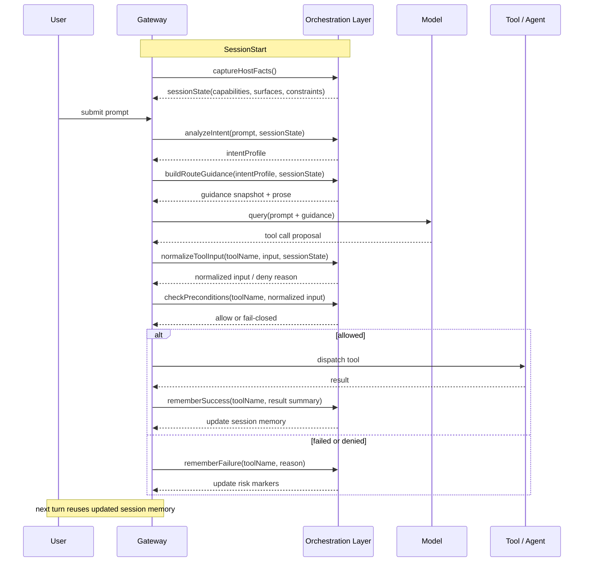

# hello2cc Gateway Lifecycle Sequence

更新时间：2026-04-06

## 目的

这篇文档补充 [hello2cc-gateway-integration-plan.md](/Users/gclm/workspace/lab/ai/gclm-code/docs/overview/hello2cc-gateway-integration-plan.md) 中提到的生命周期接线，把 Gateway 编排增强层在一次会话中的时序拆开说明。

本文重点回答：

- `hello2cc` 风格能力在 Gateway 中应该挂到哪些事件
- 每个事件负责读什么、写什么、影响什么
- 为什么这层能力能帮助第三方模型更稳定地感知当前项目能力
- 第一阶段最值得实现的主链应该长什么样

## 结论摘要

如果把 `hello2cc` 的价值抽象成一句话，就是：

在模型真正做决定之前，持续把宿主已知事实喂给模型；在模型真正执行动作之前，再用宿主规则做一次纠偏；在动作执行之后，把结果写回会话状态，影响下一轮决策。

因此它不是单次 prompt patch，而是一条跨多个生命周期事件的闭环：

1. `SessionStart` 负责采集宿主能力快照
2. `UserPromptSubmit` 负责识别意图并生成 route guidance
3. `PreToolUse` 负责工具输入规范化与前置条件检查
4. `PostToolUse` / `PostToolUseFailure` 负责把结果写回 session memory
5. 下一轮 `UserPromptSubmit` 再基于这些 memory 生成更稳的路径提示

## 生命周期总览

建议把 Gateway 编排增强层抽象成下面这条时序主链：

```text
SessionStart
  -> capture host facts
  -> initialize session orchestration state

UserPromptSubmit
  -> analyze intent profile
  -> build route guidance
  -> augment model context
  -> query model

PreToolUse
  -> normalize tool input
  -> check preconditions
  -> allow / deny / rewrite

Tool dispatch
  -> execute real tool

PostToolUse / PostToolUseFailure
  -> remember success / failure
  -> update route hints and risk markers

Next user turn
  -> reuse session memory
  -> produce better route guidance
```

## 主时序图



## 各事件职责

### 1. `SessionStart`

这一阶段只做一件事：建立宿主事实快照。

建议采集的信息包括：

- 当前可用 tool 名单
- 当前可用 agent surface
- 是否支持 team / worktree / MCP resource
- 当前环境中的关键限制
- 最近一次会话是否留下高风险失败标记

这里的关键原则是：

- 只记录宿主已确认的事实
- 不写模型猜测
- 不在这里做复杂规划

它产出的 `sessionState` 是后面所有路由与纠偏的基础。

### 2. `UserPromptSubmit`

这一阶段是 hello2cc 风格能力最核心的入口。

推荐按下面顺序处理：

1. 从用户输入中抽取轻量意图
2. 结合 `sessionState` 判断当前宿主有哪些真实路径
3. 生成一段短 prose 和一份结构化 snapshot
4. 把这份 guidance 拼接到发给模型的上下文里

这里的核心不是替模型做全部规划，而是帮模型理解：

- 这个宿主现在能做什么
- 这类请求更适合走什么路径
- 哪些动作当前不成立或成本更高
- 上一轮哪些路径已经失败过

这就是为什么它能让“不是官方模型的模型”也更容易理解当前项目能力。

因为模型看到的不是抽象描述，而是当前会话里的具体、结构化、连续更新的宿主事实。

### 3. `PreToolUse`

这一阶段处理真正会导致执行偏差的关键问题。

建议拆成两步：

1. `normalizeToolInput`
2. `checkPreconditions`

第一步解决“参数形状不对但意图大致对”的问题，例如：

- `Agent` 缺失推荐字段
- 需要 worktree 却没有显式声明
- 工具名正确但输入字段拼写混乱

第二步解决“当前条件根本不成立”的问题，例如：

- 需要 team 能力但当前上下文不适合
- worktree 前提未满足
- 已知同一路径刚刚失败，应避免立即重复

这一步要尽量 fail-closed，而不是放任模型带着错误参数撞进真实执行层。

## `PostToolUse` 与 `PostToolUseFailure`

这一阶段的目标不是保存全部结果，而是抽取对下一轮决策最有价值的记忆。

建议记录：

- 哪种路径刚刚成功
- 哪个工具刚刚失败
- 失败是否来自参数问题、环境问题或能力边界问题
- 是否出现“建议转 team / worktree”的强信号

建议不要把原始大结果整个塞回会话状态，只保留：

- 结果摘要
- 路由标签
- 风险标记
- 下一轮应避免或优先的路径

这样能控制状态大小，也更利于下一轮 guidance 稳定复用。

## 第一阶段建议实现的最小闭环

如果要先做一个最值钱的版本，建议只覆盖下面这 5 个点：

1. `SessionStart` 初始化 `sessionState`
2. `UserPromptSubmit` 生成 `intentProfile`
3. `UserPromptSubmit` 生成 `routeGuidance`
4. `PreToolUse` 对关键工具做 normalization + precondition
5. `PostToolUse` / `PostToolUseFailure` 写回 success / failure memory

对应到一次典型请求，大致如下：

```text
user asks for implementation
  -> host knows Agent / Team / worktree are available
  -> guidance tells model "prefer implementation path with worker when scope is parallelizable"
  -> model proposes Agent call
  -> PreToolUse fills missing defaults and blocks invalid shape
  -> Agent runs
  -> success writes back "worker path works in this session"
  -> next turn guidance becomes more confident about that path
```

这个闭环已经能拿到 `hello2cc` 最核心的收益。

## 为什么这层设计有效

第三方模型之所以经常“不知道宿主能力”，根因通常不是模型完全不懂工具，而是它不知道：

- 当前会话到底暴露了哪些能力
- 哪些能力是推荐路径，哪些只是理论存在
- 哪些路径刚刚在这个 session 里已经失败过
- 宿主对某些工具输入有什么隐含契约

`hello2cc` 风格设计有效，是因为它同时补了这四个缺口：

1. 用 `SessionStart` 和 `UserPromptSubmit` 暴露能力快照
2. 用 `routeGuidance` 暴露推荐路径
3. 用 `PreToolUse` 保护隐含契约
4. 用 `PostToolUse` 把执行结果变成下一轮的上下文

所以它提升的不是模型智力，而是模型对当前宿主环境的 situational awareness。

## 映射到当前仓库的推荐接线点

结合当前仓库结构，推荐接线如下：

- `SessionStart`
  - [src/utils/sessionStart.ts](/Users/gclm/workspace/lab/ai/gclm-code/src/utils/sessionStart.ts)
- `UserPromptSubmit`
  - [src/utils/processUserInput/processUserInput.ts](/Users/gclm/workspace/lab/ai/gclm-code/src/utils/processUserInput/processUserInput.ts)
- `PreToolUse` / `PostToolUse` / `PostToolUseFailure`
  - [src/utils/hooks.ts](/Users/gclm/workspace/lab/ai/gclm-code/src/utils/hooks.ts)
  - [src/Tool.ts](/Users/gclm/workspace/lab/ai/gclm-code/src/Tool.ts)
- 后续可扩展的 agent guidance
  - [src/tools/AgentTool/runAgent.ts](/Users/gclm/workspace/lab/ai/gclm-code/src/tools/AgentTool/runAgent.ts)

这也说明 hello2cc 在当前项目里更适合做成内建 orchestration 模块，而不是外置 shell 插件。

## 与实施方案文档的关系

三篇文档的职责可以这样区分：

- [hello2cc-capability-orchestration.md](/Users/gclm/workspace/lab/ai/gclm-code/docs/overview/hello2cc-capability-orchestration.md)
  - 解释原理，回答“为什么它有效”
- [hello2cc-gateway-integration-plan.md](/Users/gclm/workspace/lab/ai/gclm-code/docs/overview/hello2cc-gateway-integration-plan.md)
  - 解释架构与模块边界，回答“应该怎么集成”
- 当前这篇文档
  - 解释生命周期时序，回答“它在一次请求里具体怎么流动”

## 下一步建议

按这份时序图往下落代码时，建议顺序如下：

1. 先实现 `sessionState + intentProfile + routeGuidance`
2. 再把 `PreToolUse` 的 normalization / precondition 接到关键工具
3. 最后再补 `PostToolUse` 的 success / failure memory 和 agent guidance

这样可以先拿到主链收益，再逐步增强执行纠偏能力。
